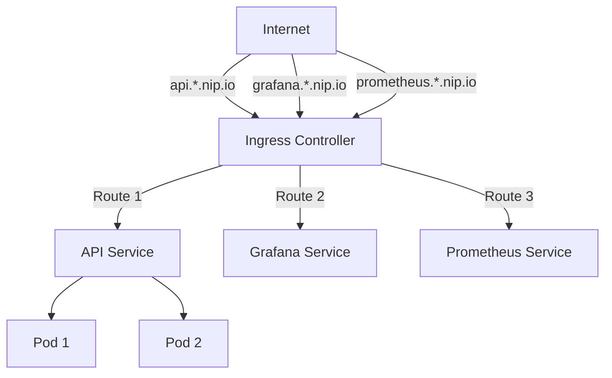

# Ingress Presentation Guide - Visual Options

## Best Ways to Show Ingress Usage in Slides

### Option 1: Architecture Diagram (RECOMMENDED) ⭐

**Why**: Visual, easy to understand, shows the flow

```
┌─────────────────────────────────────────────────────────────┐
│                    INGRESS ROUTING                          │
└─────────────────────────────────────────────────────────────┘

Internet
   │
   │ http://api.157.230.69.194.nip.io
   │ http://grafana.157.230.69.194.nip.io
   │ http://prometheus.157.230.69.194.nip.io
   ▼
┌─────────────────────────────────────────────────────────────┐
│  Ingress Controller (NGINX)                                │
│  IP: 157.230.69.194                                        │
│                                                             │
│  Routes by Hostname:                                       │
│  ├─ api.*.nip.io      → lms-api-service:80                │
│  ├─ grafana.*.nip.io  → grafana-service:3000             │
│  └─ prometheus.*.nip.io → prometheus-service:9090        │
└─────────────────────────────────────────────────────────────┘
   │
   ├─────────────────┬──────────────────┬──────────────────┐
   ▼                 ▼                  ▼                  ▼
┌─────────┐    ┌──────────┐      ┌──────────┐      ┌─────────┐
│ API     │    │ Grafana  │      │Prometheus│      │ ArgoCD │
│ Service │    │ Service  │      │ Service  │      │ Service│
└─────────┘    └──────────┘      └──────────┘      └─────────┘
   │
   ▼
┌─────────────────────────────────────────────────────────────┐
│  Pod Replicas (Load Balanced)                              │
│  ├─ Pod 1: 10.244.0.149                                    │
│  └─ Pod 2: 10.244.0.150                                    │
└─────────────────────────────────────────────────────────────┘
```

**Tools to create**:
- Draw.io / diagrams.net
- Excalidraw
- PowerPoint/Keynote shapes
- Mermaid diagrams

### Option 2: Before/After Comparison

**Slide 1: Without Ingress**
```
❌ Without Ingress:
   - Need separate LoadBalancer for each service
   - Multiple IPs to manage
   - No hostname-based routing
   - Manual SSL configuration per service
```

**Slide 2: With Ingress**
```
✅ With Ingress:
   - Single LoadBalancer IP (157.230.69.194)
   - Hostname-based routing (api.*.nip.io)
   - Centralized SSL/TLS termination
   - Rate limiting, CORS, WebSocket support
```

### Option 3: Code Screenshot (Simplified)

**Show only the key parts**:

```yaml
apiVersion: networking.k8s.io/v1
kind: Ingress
metadata:
  name: lms-ingress
  annotations:
    nginx.ingress.kubernetes.io/limit-rps: "100"
    nginx.ingress.kubernetes.io/websocket-services: "lms-api-service"
spec:
  rules:
  - host: api.157.230.69.194.nip.io
    http:
      paths:
      - path: /
        backend:
          service:
            name: lms-api-service
            port: 80
  - host: grafana.157.230.69.194.nip.io
    http:
      paths:
      - path: /
        backend:
          service:
            name: grafana-service
            port: 3000
```

**Highlight**:
- Hostname routing
- Service mapping
- Annotations (rate limiting, WebSocket)

### Option 4: Live Demo Screenshot

**Show kubectl output**:

```bash
$ kubectl get ingress
NAME          HOSTS                                                      ADDRESS          PORTS
lms-ingress   api.157.230.69.194.nip.io,                                157.230.69.194   80
              grafana.157.230.69.194.nip.io,
              prometheus.157.230.69.194.nip.io

$ kubectl describe ingress lms-ingress
Name:             lms-ingress
Rules:
  Host                          Path  Backends
  ----                          ----  --------
  api.157.230.69.194.nip.io    
                                /     lms-api-service:80 (10.244.0.149:8000)
  grafana.157.230.69.194.nip.io
                                /     grafana-service:3000 (10.244.0.148:3000)
```

### Option 5: Request Flow Diagram

```
┌─────────────────────────────────────────────────────────────┐
│  REQUEST FLOW: api.157.230.69.194.nip.io/books             │
└─────────────────────────────────────────────────────────────┘

1. DNS Resolution
   api.157.230.69.194.nip.io → 157.230.69.194
   
2. Ingress Controller
   Checks hostname → Matches "api.*.nip.io" rule
   
3. Service Routing
   Routes to → lms-api-service:80
   
4. Pod Selection
   Load balances → Pod 1 or Pod 2 (round-robin)
   
5. Response
   Pod → Service → Ingress → Client
```

### Option 6: Feature Showcase Table

| Feature | Configuration | Benefit |
|---------|--------------|---------|
| **Hostname Routing** | `host: api.*.nip.io` | Single IP, multiple services |
| **Rate Limiting** | `limit-rps: "100"` | DDoS protection |
| **WebSocket Support** | `websocket-services` | Real-time updates |
| **CORS** | `enable-cors: "true"` | Cross-origin requests |
| **SSL/TLS** | `cert-manager` | Secure connections |

### Option 7: Interactive Demo (Live Presentation)

**Show in browser**:
1. Open: `http://api.157.230.69.194.nip.io/docs`
2. Show: `http://grafana.157.230.69.194.nip.io`
3. Show: `http://prometheus.157.230.69.194.nip.io`

**Point out**: Same IP, different services based on hostname!

## Recommended Slide Structure

### Slide 1: What is Ingress?
- Definition: "Ingress exposes HTTP/HTTPS routes to services"
- Visual: Simple diagram showing Internet → Ingress → Services

### Slide 2: Our Ingress Configuration
- **Option A**: Architecture diagram (Option 1)
- **Option B**: Code screenshot (Option 3) - simplified version

### Slide 3: Key Features
- Table format (Option 6)
- Highlight: Hostname routing, Rate limiting, WebSocket

### Slide 4: Live Demo / Results
- kubectl output (Option 4)
- Or browser screenshots showing different services on same IP

## Quick Visual Creation Tools

### 1. Mermaid Diagram (for Markdown/Presentations)


### 2. ASCII Art (Quick & Simple)
```
Internet
  │
  ├─ api.*.nip.io ────────┐
  ├─ grafana.*.nip.io ────┤
  └─ prometheus.*.nip.io ─┤
                          │
                    ┌─────▼─────┐
                    │  Ingress  │
                    │ Controller│
                    └─────┬─────┘
                          │
          ┌───────────────┼───────────────┐
          │               │               │
    ┌─────▼─────┐  ┌─────▼─────┐  ┌─────▼─────┐
    │   API     │  │  Grafana  │  │ Prometheus│
    │  Service  │  │  Service  │  │  Service  │
    └───────────┘  └───────────┘  └───────────┘
```

## Pro Tips

1. **Keep it simple**: Don't show full YAML, just key parts
2. **Use colors**: Highlight different services in different colors
3. **Show the flow**: Always show request → Ingress → Service → Pod
4. **Live demo**: If possible, show actual browser/terminal
5. **Compare**: Before/after makes the benefit clear

## Example Slide Content

### Title: "Ingress: Single Entry Point, Multiple Services"

**Content**:
- **Problem**: Without Ingress, need separate LoadBalancer per service
- **Solution**: Ingress provides hostname-based routing
- **Result**: One IP (157.230.69.194), multiple services:
  - `api.*.nip.io` → API
  - `grafana.*.nip.io` → Grafana
  - `prometheus.*.nip.io` → Prometheus
- **Features**: Rate limiting, WebSocket support, CORS

**Visual**: Architecture diagram showing the flow

